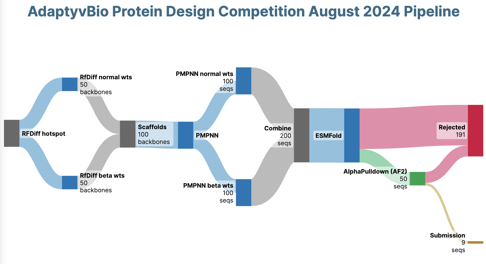

# Adaptyv Bio Protein Design Competition August 2024 Submission

Link to competition: https://design.adaptyvbio.com/

## Pipeline overview:

### Prerequisites:
- ProteinMPNN: https://github.com/dauparas/ProteinMPNN
- ESMFold: https://github.com/facebookresearch/esm
- AlphaPulldown: https://github.com/KosinskiLab/AlphaPulldown
- RFdiffusion: https://github.com/RosettaCommons/RFdiffusion

### What could have been improved
- More scaffolds
- Some sort of energy / forcefield scoring
- Relaxing the interface

### Hardware
Ran using a A100 GPU HPC server.
